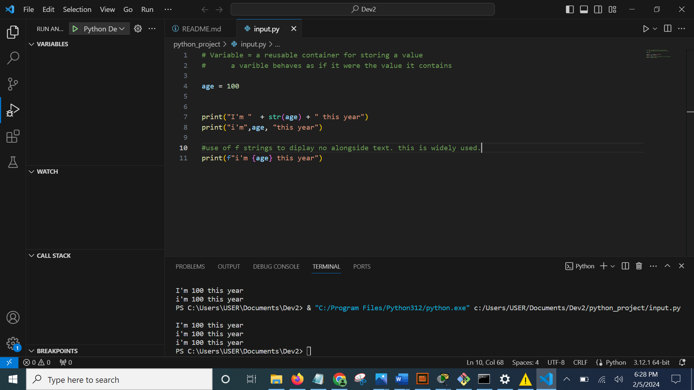
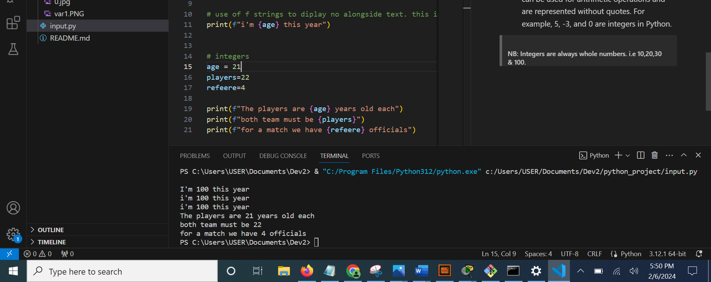
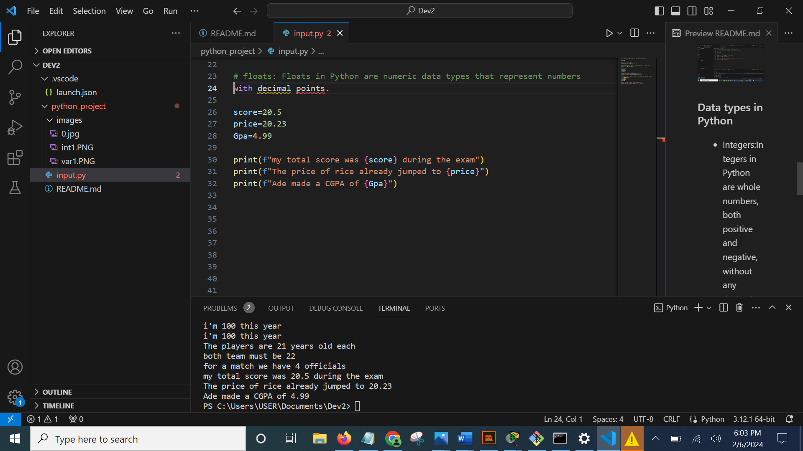
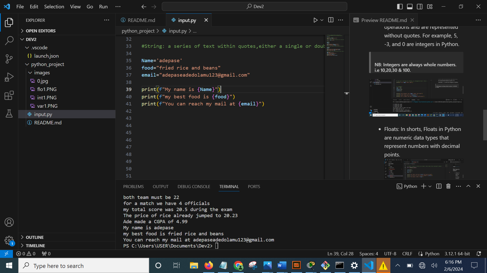
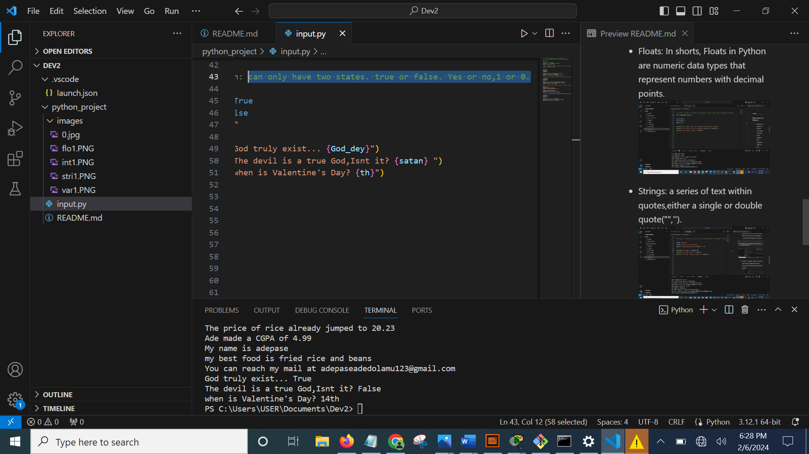

## GETTING STARTED WITH PYTHON

### What is Python
Python is a versatile, high-level programming language known for its readability and ease of use. It supports multiple paradigms, making it suitable for diverse applications, from web development to data analysis and artificial intelligence.
>#### Types of Python Input
- Variables:In Python, variables are containers for storing data values. Variables can hold different types of data, such as numbers, strings, or objects, and their values can be changed during the program execution.
>###### Writing variables

### Data types in Python
- Integers:Integers in Python are whole numbers, both positive and negative, without any decimal or fractional part. They can be used for arithmetic operations and are represented without quotes. For example, 5, -3, and 0 are integers in Python.
>###### NB: Integers are always whole numbers. i.e 10,20,30 & 100.

- Floats: In shorts, Floats in Python are numeric data types that represent numbers with decimal points.
 
- Strings: a series of text within quotes,either a single or double quote("",'').

- Boolean: can only have two states. true or false. Yes or no,1 or 0.

